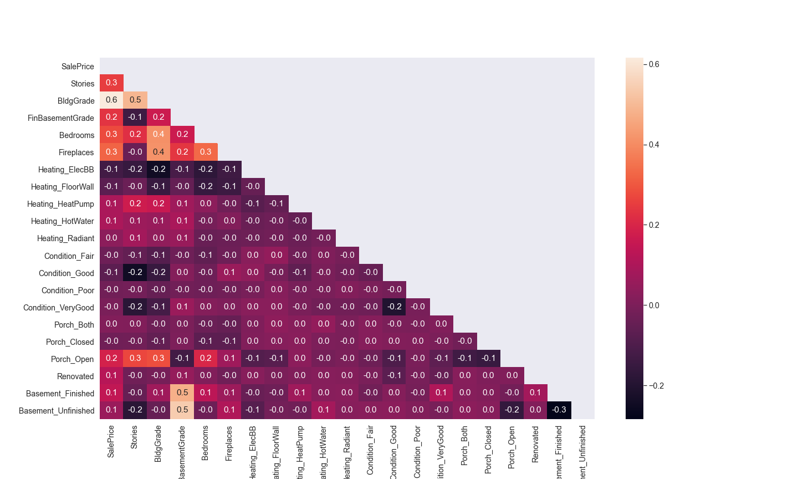
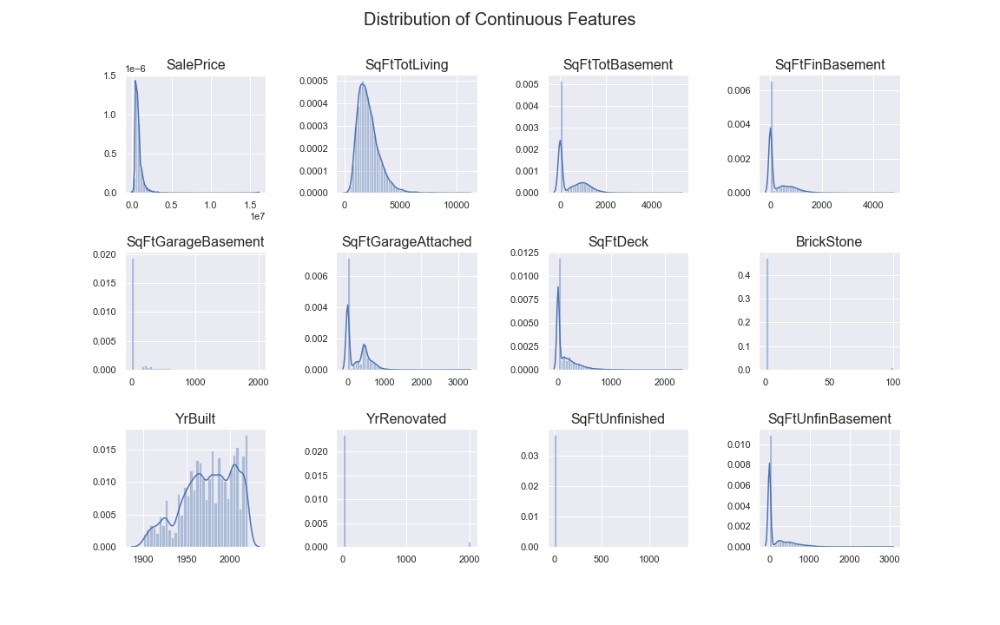

# King County Home Price Analysis
This repository offers an analysis of factors that influence housing prices in King County, WA.

## Repository Directory

```
├── README.md        <-- Main README file explaining the project's business case,
│                        methodology, and findings
│
├── data             <-- Data in CSV format
│   ├── processed    <-- Processed (combined, cleaned) data used for modeling
│   └── raw          <-- Original (immutable) data dump
│
├── notebooks        <-- Jupyter Notebooks for exploration and presentation
│   ├── exploratory  <-- Unpolished exploratory data analysis (EDA) notebooks
│   └── report       <-- Polished final notebook(s)
│
├── references       <-- Data dictionaries, manuals, and project instructions
│
└── reports          <-- Generated analysis (including presentation.pdf)
    └── figures      <-- Generated graphics and figures to be used in reporting
```

### Quick Links
1. [Final Analysis Notebook](notebooks/exploratory/final_notebook.ipynb)
2. [Presentation Slides](reports/presentation.pdf)

### Setup Instructions
This analysis uses largely standard Data Science packages. However, if you would like the full conda environment file, you may find it [here](src/linreg-env.yml).


## Business Understanding
This analysis seeks to gather valuable insight about how various home characteristics can affect sale price. It will address how common home improvements may be correlated with sale price. For example, how much can finishing your basement increase your home value? Is there any connection between the type of heating you use and the home value? Some people prefer enclosed porches to open porches - but does it impact your home value? These are all questions we will dive into deeply and seek to understand using complex inferential linear regression. 


## Data Preparation
Although over 532,000 rows of data were initially available, this was eventually narrowed down to just over 18,000. Many of these records corresponded with commercial properties or simply land without homes. More still were duplicated sale data for the same parcel, which was narrowed down further. 

In a similar fashion, there were 105 columns of data to begin with, yet the final model contains only 11 inputs. Needless to say, data preparation was a large portion of this analysis.


## Data Understanding
Once data was narrowed as described above, feature engineering was a core component. Maybe attributes were categorical in nature and thus needed to be one-hot encoded. Even afterwards, relationships were far from straightfoward. The below heat map shows the correlation between some of the most relevant features. 

First, we see some of the valuable continuous features alongside their correlation.


Next, we see a set of features that were largely engineered, whether through data aggregation or one-hot encoding. In many cases, the correlation with SalePrice remained low, making it difficult to meet all the required assumptions of a linear regression model. 

In addition to feature engineering, multiple inputs were log-transformed to meet the linearity requirements for linear regression. Taking a look at selected continuous inputs below, data skew is clearly an issue. For features that were in the end selected for the model, log transformations were essential.


## Modeling
The final model related the log-transformed Sale Price to:
1. The log-adjusted total livable square footage.
2. Observations about the porch: whether it is open, closed, or non-existent.
3. Heating systems, such as baseboard, radiant, etc.
4. Whether or not the basement is fully finished.


## Evaluation
In the end, the model performance can be summarized as:
1. Meeting the Linearity requirement with a p-value of 0.34 -- well above the necessary 0.05 alpha threshold.
2. Meeting the input indepedence requirement with a Variance Inflation Factor (VIF) of 1.34 -- well below the threshold of 5.
3. Nearly meeting the homoscedacity requirement with an F-score p-value of 0.009, less than one order of magnitude from the 0.05 alpha threshold.
4. Not meeting the normality of residuals requirement. Based on the Jarque-Bera metric, the model was very far from passing this test.
5. Producing a reasonable R squared metric of 0.40.
6. All discussed results occurred as a statistically significant level. 


## Conclusion
The model provides valuable insight about the questions under investigation. Specifically:
1. Homes with an enclosed porch tend to sell for 17% more than those with an open porch.
2. Homes with Radiant heating tend to sell for the most, whereas those with Electric Baseboard heating tend to sell for the least.
3. Homes with a completely finished basement typically sell for 18% more than homes with unfinished basements.
4. The impact between livable square footage and home sale price is striking: for every 10% increase in square footage, home value typically increases by 7%. 

With all this in mind, it is worth keeping in mind that the results are highly localized to King County in Washington and surely vary by location.